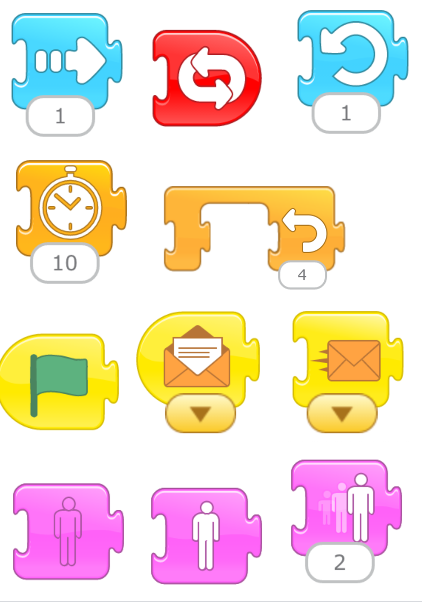

# Om oppgåven {.activity}

I denne oppgaven skal elevane laga ein animasjon. Dei kan legge inn tekst eller innspilling. Det kan vera på norsk, engelsk, eller knytta til naturfag.

## Oppgåven passer til: {.check}

 **Fag**: Matematikk, Programmering, Teknologi, Kunst og Håndverk, Engelsk, Norsk

**Anbefalte trinn**: Barnehage, 1.-4. klasse

**Tema**: Animasjon, Blokkbasert

## Kompetansemål {.challenge}

- [ ] **Kjerneelement språket som system og moglegheit**: Dei skal kunne etablerte språk- og sjangernormar, og kunne leike, utforske og eksperimentere med språket på kreative måter.
- [ ] **Kjerneelement visuell kommunikasjon**: (...) elevane skal kunne lese, forstå og bruke det visuelle språket. (...)
(2) 
- [ ] **Kunst og handverk, 2.**: skapa fortelljingar ved hjelp av digitale verktøy (...)
- [ ] **Kunst og håndverk, 2.**: vise fram og presentere objekt gjennom utstilling eller samling 
- [ ] **Engelsk, 2.**: lese og eksperimentere med å skrive kjente ord, fraser og enkle setningar
- [ ] **Norsk, 2.**: skildre og fortelje munnleg og skriftleg 
lage tekstar som kombinerer skrift med bilete
- [ ] **Norsk, 2.**: skrive tekstar for hand og med tastatur 

## Forslag til læringsmål {.challenge}

- [ ] Elevene kan laga ein digital forteling (animasjon).

## Forslag til vurderingskriterier {.challenge}

Det er mange ulike måter man kan vurdere et programmeringsprosjekt, og her må en
selv vurdere hva som er den beste måten ut ifra hvilket fag man jobber i, hvilken aldergruppe og hviklet nivå elevene er på, hva man ønsker å teste og hvor mye tid man har til rådighet til å jobbe med prosjektet. I vårt [lærerdokument (https://github.com/kodeklubben/oppgaver/wiki/Hvordan-undervise-i-og-vurdere-programmering){target=_blank} har vi blant
annet beskrevet ulike måter dette kan gjøres på, tillegg til en del andre nyttige tips til hvordan man underviser i programmering.

## Forutsetninger og utstyr {.challenge}

- [ ] **Forutsetninger**: Å kunne retningar, å kunne organisera elementar tidsmessig, å kunne følgja ein oppskrift, å kunne dra med ei mus om bruk av desktop versjon.

- [ ] **Utstyr**: nettbrett eller PC med ScratchJr (lenkje for å lasta ned ScratchJr til dekstop:  https://jfo8000.github.io/ScratchJr-Desktop/), oppskrifta (skrive ut)

## Fremgangsmåte {.challenge}

*Vi har dessverre ikke noen tips, erfaringer eller utfordringer tilknyttet denne
oppgaven enda.*

## Vurdering {.challenge}

Sams oppsummering mot slutten av timen. La elevane snakka om koden. Ei moglegheit er å vise nokre blokker ein og ein, og å spørja til elevane kva dei gjer. Til dømes:
 

## Vidare arbeid {.challenge}

Nokre idear til opne oppgåver til elevane, etter at dei har gjennomført denne oppgåva:
- Norsk/samfunnsfag: Lag ein samtale med minst to figurar. Dei kan bruke lyd eller tekst til samtalen. Samtalen kan ha eit tema (til dømes ei historisk fortelljng). Elevane kan bruke hjelpemiddelkort.
- Norsk: la elevane dine spela med ord og laga eiga samord. Innføringsvideo frå nynorsksenteret (kråkebollebilly): https://youtu.be/KUMUX4YEbew. Merk at det er mogleg i Scratch Jr å laga eiga figurar og eigne bakgrunnar. 
- Idrett: la elevane dine utføre kode som vart laga med Scratch Jr blokker; dei er datamaskina.