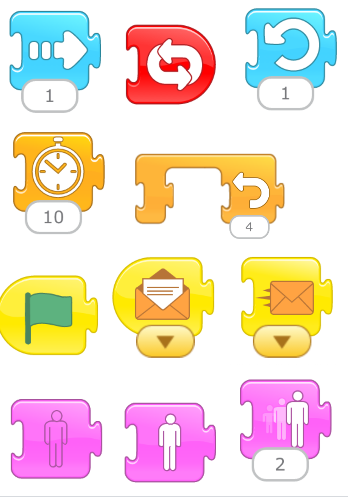

## Oppgaven passer til: {.check}

 **Fag**: Engelsk, Programmering, Matematikk

**Anbefalte trinn**: Barnehage, 1.-4. klasse

**Tema**: Blokkbasert, Animasjon

## Kompetansemål {.challenge}

- [ ] **Kjerneelement språket som system og moglegheit**: Dei skal kunne etablerte språk- og sjangernormar, og kunne leike, utforske og eksperimentere med språket på kreative måter.
- [ ] **Engelsk, 2.**: lese og eksperimentere med å skrive kjente ord, fraser og enkle setningar
- [ ] **Norsk, 2.**: skildre og fortelje munnleg og skriftleg 
lage tekstar som kombinerer skrift med bilete
- [ ] **Norsk, 2.**: skrive tekstar for hand og med tastatur 

## Forutsetninger og utstyr {.challenge}

- [ ] **Forutsetninger**: Å kunne retningar, å kunne organisera elementar tidsmessig, å kunne følgja ein oppskrift, å kunne dra med ei mus om bruk av desktop versjon.

- [ ] **Utstyr**: nettbrett eller PC med ScratchJr (lenkje for å lasta ned ScratchJr til dekstop:  https://jfo8000.github.io/ScratchJr-Desktop/), oppskrifta (skrive ut)

## Fremgangsmåte {.challenge}

*Vi har dessverre ikke noen tips, erfaringer eller utfordringer tilknyttet denne
oppgaven enda.*

## Vurdering {.challenge}

Sams oppsummering mot slutten av timen. La elevane snakka om koden. Ei moglegheit er å vise nokre blokker ein og ein, og å spørja til elevane kva dei gjer. Til dømes:
